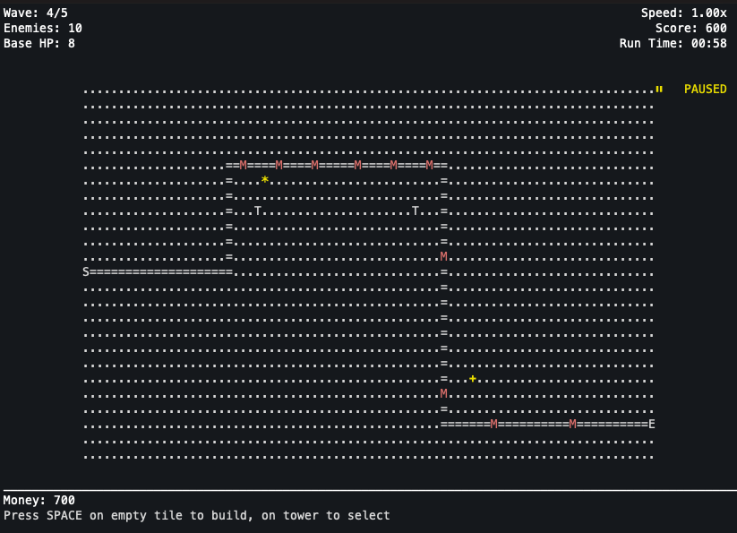

# Terminal Tower Defense 👾

A terminal-based tower defense game built with Go and tcell.



> 🚧 **macOS:** Downloaded binaries may be blocked by Gatekeeper ("cannot be opened" / "not verified").  
> The app is unsigned (code signing requires a paid Apple Developer account). You can:
>
> 1. On Terminal: `xattr -d com.apple.quarantine terminal-td-v0.1.0-darwin-arm64` (use the actual path and filename).
> 2. Or **build from source:** `./build.sh mac-arm` then run the binary from the `builds/` folder.

## Quick Start ⚡

```bash
go run cmd/game/main.go
```

Or build and run:

```bash
go build -o terminal-td cmd/game/main.go
./terminal-td
```

## Controls 🎮

**Movement:**
- Arrow Keys or `WASD` - Move cursor

**Building:**
- `B` - Toggle build mode
- `SPACE/ENTER` - Place tower / Select tower
- `ESC` - Cancel / Deselect

**Gameplay:**
- `P` - Pause / Unpause
- `+/-` - Increase / Decrease game speed
- `R` - Restart (when game over)

**Quit:**
- `ESC` - Quit game (with confirmation)

## Features 🪄

- Tower placement and management
- Enemy waves with increasing difficulty
- Projectile-based combat system
- Real-time range visualization
- Economy system (earn money from kills)
- Wave progression system

## Requirements 📝

- Go 1.25+
- Terminal with UTF-8 support

## Building 🔧

Build for your platform:

```bash
go build -o terminal-td cmd/game/main.go
```

Cross-compile for other platforms:

```bash
# Windows
GOOS=windows GOARCH=amd64 go build -o terminal-td.exe cmd/game/main.go

# Linux
GOOS=linux GOARCH=amd64 go build -o terminal-td cmd/game/main.go

# macOS
GOOS=darwin GOARCH=amd64 go build -o terminal-td cmd/game/main.go
```

Or use the [build script](build.sh) to build for all platforms.

**Build script:** `./build.sh [platform]` produces versioned folders and zips in `builds/` (e.g. `terminal-td-v0.1.2-windows-amd64/` and `terminal-td-v0.1.2-windows-amd64.zip`). Each folder/zip contains the game binary, `terminal-td-updater`, and `readme.txt`. Default `all`; use `./build.sh --help` for options.

**Auto-update:** With "Check for updates" on in Settings, the game notifies when a newer release exists. Choosing "Update available" downloads the zip for the current platform, extracts it, replaces the game and updater, then restarts.

---