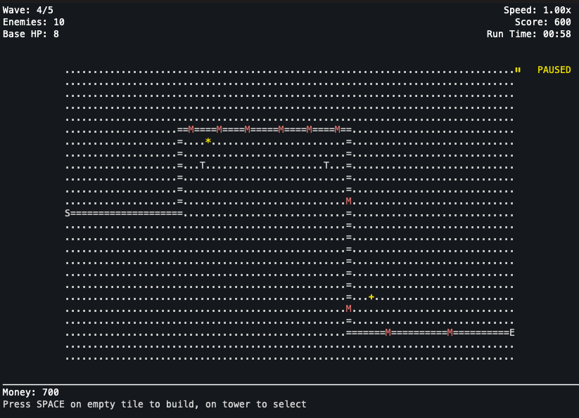

# Terminal Tower Defense 👾

A terminal-based tower defense game built with Go and tcell.



## Install 📦

### Option 1: Homebrew (macOS, recommended)

```bash
brew tap Larry8668/terminal-td
brew install --cask terminal-td
```

If Homebrew refuses the tap with an "untrusted tap" error, trust it first
(a one-time step Homebrew requires for third-party taps in general, not
specific to this project) and re-run the install:

```bash
brew trust larry8668/terminal-td
```

Homebrew installs are unaffected by the Gatekeeper warning below — the cask
strips the quarantine flag automatically. Updates go through
`brew upgrade --cask terminal-td` (the in-app updater is disabled for
Homebrew installs).

### Option 2: Download a prebuilt binary

Grab the archive for your platform from the
[Releases page](https://github.com/Larry8668/terminal-td/releases) (`.tar.gz`
for macOS/Linux, `.zip` for Windows), extract it, and run the binary inside.

> 🚧 **macOS:** a manually downloaded binary may be blocked by Gatekeeper
> ("cannot be opened" / "not verified") since it's unsigned (code signing
> requires a paid Apple Developer account). Fix it with:
>
> ```bash
> xattr -d com.apple.quarantine /path/to/terminal-td
> ```
>
> (use the actual extracted path). Not needed with the Homebrew install above.

### Option 3: Build from source

```bash
go run cmd/game/main.go
```

Or build and run:

```bash
go build -o terminal-td cmd/game/main.go
./terminal-td
```

## Controls 🎮

**Movement:**
- Arrow Keys or `WASD` - Move cursor

**Building:**
- `B` - Toggle build mode
- `SPACE/ENTER` - Place tower / Select tower
- `ESC` - Cancel / Deselect

**Gameplay:**
- `P` - Pause / Unpause
- `+/-` - Increase / Decrease game speed
- `R` - Restart (when game over)

**Quit:**
- `ESC` - Quit game (with confirmation)

## Features 🪄

- Tower placement and management
- Enemy waves with increasing difficulty
- Projectile-based combat system
- Real-time range visualization
- Economy system (earn money from kills)
- Wave progression system

## Requirements 📝

- Go 1.25+
- Terminal with UTF-8 support

## Building 🔧

Build for your platform:

```bash
go build -o terminal-td cmd/game/main.go
```

Cross-compile for other platforms:

```bash
# Windows
GOOS=windows GOARCH=amd64 go build -o terminal-td.exe cmd/game/main.go

# Linux
GOOS=linux GOARCH=amd64 go build -o terminal-td cmd/game/main.go

# macOS
GOOS=darwin GOARCH=amd64 go build -o terminal-td cmd/game/main.go
```

Or use the [build script](build.sh) to build for all platforms.

**Build script:** `./build.sh [platform]` produces versioned folders and zips in `builds/` (e.g. `terminal-td-v0.1.2-windows-amd64/` and `terminal-td-v0.1.2-windows-amd64.zip`). Each folder/zip contains the game binary and `readme.txt`. Default `all`; use `./build.sh --help` for options. This is a manual/legacy path -- tagged releases are built and published by [GoReleaser](.goreleaser.yaml) via CI (see `.github/workflows/release.yml`), which also updates the Homebrew cask.

**Auto-update:** With "Check for updates" on in Settings, the game notifies when a newer GitHub release exists. Choosing "Update available" downloads the archive for the current platform, extracts it, and replaces the running binary in place; reopen the game afterward to run the new version. Installs via Homebrew skip this entirely -- `brew upgrade --cask terminal-td` is the update path there instead.

---